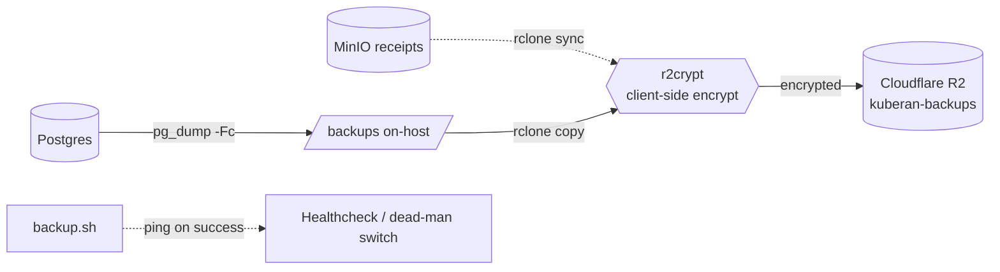
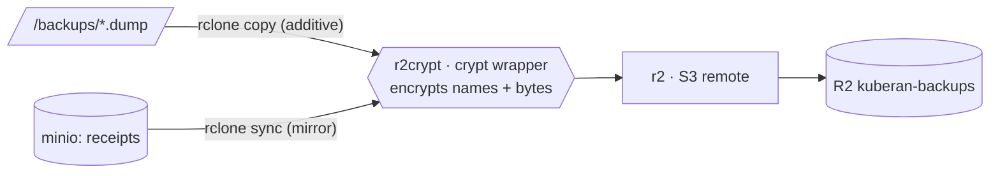

# Backup & Disaster Recovery

Off-host, client-side-encrypted replication of the Postgres dumps and the MinIO
receipts bucket to Cloudflare R2. This is the operational reference: topology,
one-time setup (Cloudflare + rclone), enabling, restore drills, and failure
response. It was introduced by plan 017 Phase 0 and is independent of the
receipts feature — it works with or without receipts deployed.

The on-host piece (`apps/backup/backup.sh`, cron via supercronic) already runs
`pg_dump -Fc` into a host bind mount. This adds the **off-host** leg so a single
disk loss can't take out the DB and every backup at once.

The off-host copy is driven by [**rclone**](https://rclone.org/) — an
open-source command-line tool for copying and syncing files to and between
cloud / S3-compatible object stores (think "rsync for object storage"). It is
already installed in the backup image (`apps/backup/Dockerfile`); you configure
it entirely through environment variables (see §2), so there's no `rclone.conf`
to manage.

## Topology



- `backup.sh` runs on the supercronic schedule inside the `backup` service
  (behind the `backup` compose profile).
- On-host `/backups` keeps `BACKUP_RETENTION_DAYS` (default 30) of `.dump` files.
- `r2crypt` is an rclone **crypt** remote wrapping the `r2` S3 remote, so both
  filenames and contents are encrypted before leaving the host — Cloudflare
  stores only ciphertext.
- The receipts mirror activates automatically once receipts deploy: the compose
  `backup` service sets `RECEIPTS_BUCKET`, and it `depends_on` `minio-init`, so a
  reboot can't fire the mirror before MinIO is provisioned. It stays a no-op
  only while the `RCLONE_CONFIG_MINIO_*` source remote is unconfigured.

## Off-host replication is optional

`backup.sh` guards the whole off-host leg on `RCLONE_CONFIG_R2CRYPT_REMOTE`.
Leave it unset and the service keeps making on-disk-only backups. Everything
below is only needed for the off-host copy.

---

## 1 · Cloudflare R2 (one-time, in the dashboard)

### 1a. Create the bucket

**R2 → Overview → Create bucket**. Name it `kuberan-backups`. A **Standard**
bucket is fine. The location/jurisdiction changes your endpoint host (EU
buckets use `.eu.r2…`).

### 1b. Note your Account ID → endpoint

The R2 Overview shows the S3 API endpoint. This is `RCLONE_CONFIG_R2_ENDPOINT`:

```
https://<ACCOUNT_ID>.r2.cloudflarestorage.com
# EU jurisdiction: https://<ACCOUNT_ID>.eu.r2.cloudflarestorage.com
```

### 1c. Create a scoped S3 API token

**R2 → Manage R2 API Tokens → Create**. Choose permission **Object Read &
Write** and **Apply to specific buckets only → `kuberan-backups`** (least
privilege — no admin, no other buckets). On create you get an **Access Key ID**
and a **Secret Access Key**; the **secret is shown once**, so copy both now.

```
Access Key ID      → RCLONE_CONFIG_R2_ACCESS_KEY_ID
Secret Access Key  → RCLONE_CONFIG_R2_SECRET_ACCESS_KEY
```

### 1d. Protect the off-host copy from tampering (bucket lock)

**R2 has no object versioning** — `PutBucketVersioning`/`GetBucketVersioning`
are unimplemented in R2's S3 API, so there is no "restore a prior version" after
a bad write. R2's equivalent protection is a **Bucket Lock**: a retention / WORM
policy (bucket **Settings → Bucket Lock**, or the API) that blocks objects from
being deleted or overwritten for a set period — or indefinitely. Apply one to
`kuberan-backups` so the append-only DB dumps (pushed with `rclone copy`) can't
be tampered with or deleted, even by a compromised host.

The receipts mirror is the subtle case: it uses a destructive `rclone sync`
(§2), which deletes remote objects that are gone from source. Because R2 can't
version, a bad sync is otherwise unrecoverable, and a bucket lock would *reject*
the sync's own deletes (fighting each other). The clean fix is to run that sync
with rclone's `--backup-dir`, which **moves** would-be-deletions to a
timestamped prefix instead of erasing them — a recovery trail without
versioning. `backup.sh` does not do this yet; see the note in §2.

---

## 2 · rclone configuration (`.env.prod`)

The remotes are defined entirely by env vars — no `rclone.conf` file. Copy the
block from `.env.prod.example` and fill it in:

```ini
# r2: raw S3 remote — the token + endpoint from step 1
RCLONE_CONFIG_R2_TYPE=s3
RCLONE_CONFIG_R2_PROVIDER=Cloudflare
RCLONE_CONFIG_R2_ACCESS_KEY_ID=<access key id>
RCLONE_CONFIG_R2_SECRET_ACCESS_KEY=<secret access key>
RCLONE_CONFIG_R2_ENDPOINT=https://<ACCOUNT_ID>.r2.cloudflarestorage.com

# r2crypt: encryption wrapper around r2:kuberan-backups
RCLONE_CONFIG_R2CRYPT_TYPE=crypt
RCLONE_CONFIG_R2CRYPT_REMOTE=r2:kuberan-backups
RCLONE_CONFIG_R2CRYPT_PASSWORD=<rclone obscure output>
RCLONE_CONFIG_R2CRYPT_PASSWORD2=<rclone obscure output, salt>

# minio: source for the receipts mirror — SAME scoped keys as STORAGE_*
RCLONE_CONFIG_MINIO_TYPE=s3
RCLONE_CONFIG_MINIO_PROVIDER=Minio
RCLONE_CONFIG_MINIO_ACCESS_KEY_ID=<= STORAGE_ACCESS_KEY>
RCLONE_CONFIG_MINIO_SECRET_ACCESS_KEY=<= STORAGE_SECRET_KEY>
RCLONE_CONFIG_MINIO_ENDPOINT=http://minio:9000

# dead-man's-switch (pinged only on full success)
HEALTHCHECK_URL=https://hc-ping.com/<uuid>
```

Generate the crypt passphrases locally and **also store the plaintext in an
off-VPS password manager** — losing them makes every off-host copy permanently
unrecoverable (`rclone obscure` only prevents shoulder-surfing; rclone can
reverse it):

```sh
rclone obscure 'a-long-random-passphrase'   # -> RCLONE_CONFIG_R2CRYPT_PASSWORD
rclone obscure 'a-second-random-salt'        # -> RCLONE_CONFIG_R2CRYPT_PASSWORD2
```

### How the three remotes compose



- **`r2`** is the raw S3 remote; you never write to it directly.
- **`r2crypt`** wraps `r2:kuberan-backups` and encrypts filenames + contents
  client-side.
- **`minio`** is the mirror **source** — the same scoped service account the API
  uses (`STORAGE_ACCESS_KEY`/`STORAGE_SECRET_KEY`), which already has
  `ListBucket` + `GetObject`.
- **copy** (DB dumps) never deletes; local retention prunes them. **sync**
  (receipts) mirrors deletes remote extras — and since R2 has no versioning
  (§1d), a bad sync is destructive.

### Notes / gotchas

- **rclone ≥ v1.59** — older versions return `401` against R2.
- `backup.sh` passes `--s3-no-check-bucket`, R2's recommended `no_check_bucket`
  behavior for object-scoped tokens, so a scoped token won't error trying to
  HEAD the bucket.
- `RECEIPTS_BUCKET` is supplied by the compose `backup` service (`= STORAGE_BUCKET`);
  you don't set it by hand.
- **Receipts mirror is destructive today.** `backup.sh` runs `rclone sync`
  without `--backup-dir`, so a source-side loss propagates to R2 with no
  recovery trail (R2 can't version). Hardening this — adding `--backup-dir` so
  deletions are moved aside — is a recommended follow-up. The DB dumps use
  `rclone copy` and are not exposed to this.

---

## 3 · Enable & verify

```sh
# Bring the backup service up (it's behind the `backup` profile).
COMPOSE_PROFILES=backup ./deploy/deploy.sh

# Trigger a one-off run inside the running service.
docker compose -f docker-compose.prod.yml exec backup /backup.sh

# Confirm the encrypted object landed (decrypted listing via the crypt remote).
docker compose -f docker-compose.prod.yml exec backup rclone ls r2crypt:db/
```

A full-success run also flips the healthcheck to "up". Because `backup.sh` runs
under `set -eu`, any earlier failure aborts before the healthcheck ping — so a
**missed ping means the run failed** somewhere before the dead-man's-switch line.

## 4 · Restore drill (do this once before relying on it)

Restore into a **scratch database**, never straight over production.

```sh
# 1. Pull the newest encrypted dump back and decrypt it in one step.
rclone copy r2crypt:db/ ./restore/ --include '*.dump'

# 2. Restore into a fresh scratch DB.
createdb kuberan_restore
pg_restore --no-owner --no-acl -d kuberan_restore ./restore/kuberan_<ts>.dump

# 3. Sanity-check row counts against expectations.
psql -d kuberan_restore -c '\dt'
psql -d kuberan_restore -c 'SELECT count(*) FROM transactions;'

# 4. (Once receipts deploy) restore the receipts bucket.
rclone copy r2crypt:receipts/ minio:kuberan-receipts/ --s3-no-check-bucket
```

Verify the app boots against the scratch DB, then drop it.

## 5 · Failure response

| Symptom | Likely cause | Action |
|---------|--------------|--------|
| Healthcheck flips to "down" | `pg_dump`, `rclone`, or connectivity failed | Read the backup container logs; the last `log` line marks the failing step. |
| `rclone` auth error | Rotated/expired R2 token | Regenerate the R2 token, update `RCLONE_CONFIG_R2_*` in `.env.prod`, redeploy. |
| Decrypt fails on restore | Wrong passphrase | Use the passphrase pair from the off-VPS password manager; both `PASSWORD` and `PASSWORD2` must match. |
| Receipts mirror deleted objects | Bad `sync` (R2 has no versioning) | Recover from the `--backup-dir` trail if enabled; otherwise re-mirror from the live MinIO source bucket. Prevent recurrence per §1d. |

---

See also: [receipts.md](receipts.md) for the storage service setup, and
`.env.prod.example` for the full annotated variable list.
