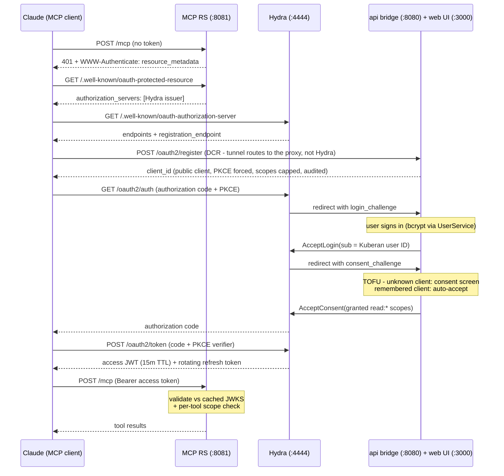

# MCP OAuth 2.1 via Ory Hydra

How the Kuberan MCP server authenticates MCP clients (Claude connectors), why
Ory Hydra is the authorization server, and how the pieces fit together.

Implementation history lives in `plans/015-mcp-oauth-hydra/`; the live-ops
checklist (E2E verification, Cloudflare hardening) is
`plans/015-mcp-oauth-hydra/PHASE-3-5-RUNBOOK.md`.

---

## Why OAuth, and why Hydra

The MCP server originally used a hand-issued, 1-year static JWT: minted via
`POST /auth/mcp-token`, copy-pasted into client config, hash stored on the user
row for revocation. That path is deleted. It had no refresh mechanism, required
manual rotation, and was not the flow MCP clients drive: Claude connectors are
added by URL and expect to run an **OAuth 2.1 authorization-code flow with
Dynamic Client Registration (DCR, RFC 7591)** - the client registers *itself*
as an OAuth client, no human pre-registers anything.

That DCR requirement decided the authorization server:

| Criterion | Roll our own AS | Zitadel | **Ory Hydra** |
|---|---|---|---|
| DCR (RFC 7591) - MCP hard requirement | Build it | Not supported | **Built-in** |
| Security-critical crypto authored by us | All of it | None | **None** |
| User store / login UI | Have it | Included (unused) | **Reuse `UserService`** |

Hydra is *headless*: it manages no users. When a login or consent decision is
needed, Hydra redirects to URLs we own with a challenge token, and we answer
via its private admin API. That keeps Kuberan's existing `UserService` (bcrypt,
lockout, `IsActive`) as the sole identity source - no second user store, no Ory
Kratos.

## Components

| Component | Where | Role |
|---|---|---|
| Ory Hydra (`oryd/hydra`, pinned in compose) | `:4444` public, `:4445` admin | Authorization Server: authorize/token endpoints, JWKS signing keys, refresh rotation, client store |
| MCP server | `apps/api/cmd/mcp`, `internal/mcp/`, `:8081` | OAuth **Resource Server**: validates access tokens offline against Hydra's JWKS |
| Login/consent bridge | `internal/handlers/oauth_handler.go`, `internal/hydra/` | Browser-callable endpoints that resolve Hydra's login/consent challenges via the admin API (the browser never talks to `:4445`) |
| Hardened DCR proxy | `internal/handlers/registration_handler.go`, served at `/oauth2/register` on `:8080` | Fronts client self-registration: forces public clients + PKCE (S256), restricts grants to `authorization_code`/`refresh_token`, caps scopes to the `read:*` set, audits + alerts every registration |
| Login/consent pages | `apps/web` `/oauth/login`, `/oauth/consent` | UI for Hydra's login/consent redirects |
| `trusted_oauth_clients` table | migration + `internal/services` | Trust-on-first-use: unknown clients get a consent screen; remembered clients auto-accept |

Hydra stores its own tables via `hydra migrate sql` (the `hydra-migrate`
compose service) in a dedicated database/schema on the same Postgres instance -
**not** managed by golang-migrate. On Supabase this is a `hydra` schema +
dedicated role, targeted via `&search_path=hydra` in `HYDRA_DSN` over the
session pooler (port 5432; Hydra's long-lived connections break on the 6543
transaction pooler).

## The flow (first connect)



Every request to `/mcp` without a valid Bearer token gets an HTTP **401** with
a `WWW-Authenticate: Bearer resource_metadata="..."` challenge
(`requireBearer` + `withWWWAuthenticate` in `internal/mcp/server.go`). This
401 is not just access control - it is what *triggers* the client's OAuth
discovery. In-band tool errors over HTTP 200 do not.

## Token validation (Resource Server)

`internal/mcp/validator.go` (`HydraValidator`) validates offline against
Hydra's cached JWKS - no per-request DB or network hop:

- RS256 signature, `exp`/`nbf`, `iss` == Hydra issuer, `aud` contains
  `MCP_RESOURCE_URL`.
- `sub` is the Kuberan user ID (set by the bridge at `AcceptLogin`).
- Scopes: Hydra emits them as the **`scp` claim (JSON array)**; the validator
  reads `scp` first and falls back to `scope` (space-delimited string, the
  convention other servers use). See "hard-won interop notes" below.

Each MCP tool then enforces its required scope via `requireScope` (e.g.
`list_accounts` needs `read:accounts`). The canonical scope set is
`config.DefaultOAuthScopes`; Hydra v2.x has no global scope registry, so scope
policy is enforced entirely code-side (DCR proxy caps, consent bridge grants
the subset, RS enforces per tool).

Tradeoff: dropping the per-request user lookup means `IsActive` is checked at
login time, not per call. Mitigations: 15-minute access TTL + inactive users
are rejected by `GetUserByEmail` at `AcceptLogin` (pinned by a regression
test).

## Deployment topology

Public ingress is an **external Cloudflare tunnel** (managed outside this
repo) that reaches services via host-published ports. Required mapping - order
matters, the path rule must precede the catch-all:

| Public hostname | Host port | Purpose |
|---|---|---|
| `auth.<domain>` path `/oauth2/register` | `:8080` (api) | Hardened DCR proxy |
| `auth.<domain>` all other paths | `:4444` (hydra) | Authorize, token, JWKS, discovery |
| `mcp.<domain>` | `:8081` (mcp) | Resource Server + protected-resource metadata |
| app domain `/oauth/login`, `/oauth/consent` | `:3000` (web) | Login + consent pages |

Hydra admin (`:4445`) is never published by compose and never mapped in the
tunnel. Routing `/oauth2/register` straight to Hydra would bypass every DCR
control.

Configuration is via `.env.prod` (see `.env.prod.example`): `HYDRA_DSN`,
`HYDRA_SECRETS_SYSTEM`, `HYDRA_ISSUER_URL`, `HYDRA_ADMIN_URL` (must be the
Docker-network URL `http://hydra:4445` - the localhost default silently breaks
the bridge), `HYDRA_LOGIN_URL`, `HYDRA_CONSENT_URL`, `MCP_RESOURCE_URL`.

## Hard-won interop notes

These four bugs passed all unit tests and only surfaced against the real
Claude client + real Hydra. If auth breaks after an upgrade, start here:

1. **The 401 must be HTTP-level.** MCP clients begin OAuth discovery from a
   401 + `WWW-Authenticate` on the transport endpoint. Tool-level "unauthorized"
   results over HTTP 200 leave clients connected-but-broken.
2. **`registration_endpoint` is opt-in.** Hydra omits it from both discovery
   documents unless `webfinger.oidc_discovery.client_registration_url` is set
   (env: `WEBFINGER_OIDC_DISCOVERY_CLIENT_REGISTRATION_URL`, pointed at the
   DCR proxy). Without it, clients complete discovery and have nowhere to
   register.
3. **Scopes live in `scp`, not `scope`.** Hydra JWT access tokens carry granted
   scopes as an `scp` JSON array. A validator reading only `scope` sees zero
   scopes and every tool fails with "missing required scope".
4. **RFC 8414 needs Hydra >= v25.4.0.** Older Hydra 404s
   `/.well-known/oauth-authorization-server` and only serves
   `/.well-known/openid-configuration`. Clients should fall back, but serving
   the primary path removes the gamble. (Ory switched to CalVer; v25.x
   continues the 2.x line, config-compatible.)

There is a fifth latent ambiguity, documented with its fix in the runbook §2b:
the resource identity is host-only (`https://mcp.<domain>`), which is
spec-compliant as long as clients honor the `resource_metadata` hint. If a
strict client demands a path-inclusive identity (`.../mcp`), follow the runbook
- do not apply that change pre-emptively.

## Verifying a deployment

Fast checks (all should pass before involving a real client):

```sh
# 401 + resource_metadata challenge on the transport endpoint
curl -si -X POST https://mcp.<domain>/mcp | grep -i "HTTP\|www-authenticate"

# Protected Resource Metadata: resource, authorization_servers, scopes
curl -s https://mcp.<domain>/.well-known/oauth-protected-resource | jq

# AS metadata advertises a registration_endpoint; JWKS resolves
curl -s https://auth.<domain>/.well-known/oauth-authorization-server \
  | jq '{issuer, authorization_endpoint, token_endpoint, jwks_uri, registration_endpoint}'

# Admin port must be unreachable (expect timeout)
curl -si --max-time 5 https://auth.<domain>:4445/admin/clients

# DCR routes to the proxy, not Hydra: an invalid body must return the
# Kuberan AppError shape {"error":{"code":"INVALID_INPUT",...}}, not a Hydra error
curl -s -X POST https://auth.<domain>/oauth2/register -d 'not-json'
```

Then the real test: add a custom connector in Claude pointing at
`https://mcp.<domain>/mcp` and drive login -> consent -> tool calls -> wait out
the 15-minute TTL -> confirm silent refresh. Full pass criteria in the runbook.
