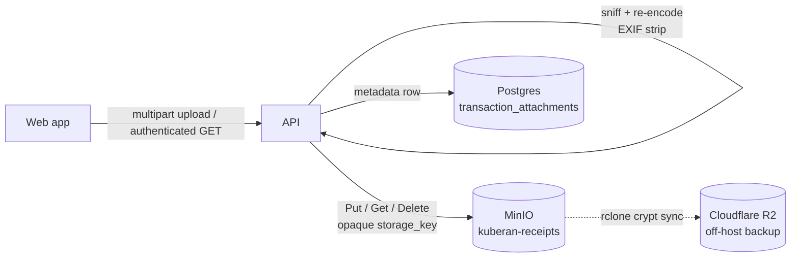

# Receipt Attachments

Kuberan lets users attach receipt images and PDFs to transactions. Files are
stored in a private, S3-compatible object store (MinIO), never on the app
database, and are served back only through the authenticated API. This document
covers the architecture, configuration, API, and the security model.

Design and phased rollout: `plans/017-transaction-receipts/`.

## Architecture

- **Metadata** (`transaction_attachments` table, migration `000025`) holds the
  file name, content type, byte size, checksum, and an opaque `storage_key`.
  `storage_key` and `checksum` are never exposed in JSON.
- **Bytes** live in the object store under a random opaque key (no user-supplied
  filename in the path). The store is abstracted behind the `BlobStore`
  interface (`internal/storage`): `S3BlobStore` in dev/prod, `MemBlobStore` in
  tests.
- **Serving** is always proxied through the API with an ownership check; MinIO
  is never exposed publicly. See [Serving & headers](#serving--headers).
- **Off-host backup**: the receipts bucket is mirrored to Cloudflare R2,
  client-side encrypted, by the backup service. See
  `plans/017-transaction-receipts/RUNBOOK.md`.

## Upload pipeline

Every uploaded file is treated as untrusted and passes through, in order:

1. **Body cap** — `http.MaxBytesReader` rejects anything over `MAX_UPLOAD_BYTES`
   before the multipart form is parsed.
2. **Per-transaction cap** — rejected with `409 ATTACHMENT_LIMIT` once a
   transaction already has `MAX_ATTACHMENTS_PER_TX` attachments.
3. **Magic-byte sniff** — the content type is detected from the bytes, never
   from the client's `Content-Type` or file extension. Allowlist:
   `image/jpeg`, `image/png`, `image/webp`, `application/pdf`.
4. **Normalize** (`internal/storage/image.go`):
   - Raster images (JPEG/PNG) are decoded and re-encoded, which **strips all
     EXIF/GPS metadata** and defuses decompression bombs (a 50 MP decode cap is
     enforced from the header before full decode).
   - WebP is transcoded to JPEG.
   - PDFs pass through after a magic-byte check (not re-encoded).
5. **Store then record** — bytes are `Put` to the object store first, then the
   metadata row is created. If the DB write fails, the just-stored object is
   best-effort deleted so no orphan is left.

## Configuration

Backend env vars (see `apps/api/internal/config/config.go`):

| Variable | Default | Purpose |
|----------|---------|---------|
| `STORAGE_ENDPOINT` | — | S3/MinIO endpoint, e.g. `http://minio:9000` (internal only) |
| `STORAGE_BUCKET` | — | Bucket name, e.g. `kuberan-receipts`. Setting this enables the feature. |
| `STORAGE_ACCESS_KEY` | — | Scoped service-account access key |
| `STORAGE_SECRET_KEY` | — | Scoped service-account secret key |
| `STORAGE_USE_PATH_STYLE` | `true` | Path-style addressing (required for MinIO) |
| `MAX_UPLOAD_BYTES` | `10485760` (10 MiB) | Per-file size cap |
| `MAX_ATTACHMENTS_PER_TX` | `10` | Per-transaction attachment cap |

In production, `STORAGE_SECRET_KEY` must be set whenever `STORAGE_BUCKET` is
configured (enforced by config validation). The API constructs the blob store
unconditionally, so `STORAGE_BUCKET` must be set for the server to boot.

### Dev

`docker-compose.yml` runs a private `minio` service (unpublished S3 port) plus a
one-shot `minio-init` that creates the `kuberan-receipts` bucket and mints a
**scoped** service account (least-privilege inline policy, not root). The `api`
service depends on `minio-init` completing and reads the `STORAGE_*` vars.

### Prod

`docker-compose.prod.yml` adds the same private `minio` + `minio-init`, but
internal-only (never published through cloudflared), with **bucket versioning
enabled**. `RECEIPTS_BUCKET` is set on the backup service so the off-host R2
mirror activates. See the Phase 4 section of the plan and `.env.prod.example`.

## API

All routes are under `/api/v1`, require a Bearer token, and are user-scoped.

| Method | Path | Body | Response |
|--------|------|------|----------|
| POST | `/transactions/:id/attachments` | multipart `file` | `201 { attachment }` |
| GET | `/transactions/:id/attachments` | — | `200 { attachments: [] }` |
| GET | `/transactions/:id/attachments/:aid` | — | `200` binary (image/pdf) |
| DELETE | `/transactions/:id/attachments/:aid` | — | `204` |

`Attachment` JSON: `{ id, transaction_id, file_name, content_type, byte_size, created_at }`
(never exposes `storage_key` or `checksum`).

Errors follow the standard `AppError` envelope:

| Status | Code | Cause |
|--------|------|-------|
| 400 | `INVALID_INPUT` | Missing/invalid multipart file |
| 403/404 | ownership | Transaction or attachment not owned by the caller |
| 409 | `ATTACHMENT_LIMIT` | Per-transaction cap reached |
| 413 | `PAYLOAD_TOO_LARGE` | File exceeds `MAX_UPLOAD_BYTES` |
| 415 | `UNSUPPORTED_MEDIA_TYPE` | Type not in the allowlist |

The transaction list responses include an `attachments_count` per transaction so
the UI can show a paperclip indicator without a second round-trip.

## Serving & headers

Downloads stream from the object store through the API only after an ownership
check. Responses carry hardened headers so a stored file can never execute or be
reinterpreted in a browsing context:

- `Content-Type`: the server-sniffed type (not the stored/claimed type)
- `Content-Disposition: inline`
- `X-Content-Type-Options: nosniff`
- `Content-Security-Policy: default-src 'none'; sandbox`
- `Cross-Origin-Resource-Policy: same-origin`
- `Cache-Control: private, no-store`

The frontend fetches these authenticated blobs and renders them via object URLs
(images inline / in a lightbox, PDFs in a new tab), revoking the URLs on unmount.

## Security notes

This is the first untrusted-binary path in the codebase; the full checklist and
`security-auditor` findings live in `plans/017-transaction-receipts/`. Key
properties:

- MinIO is private (internal network only) and the API's credential is a scoped
  service account with a least-privilege inline policy (`Get/Put/DeleteObject` +
  `ListBucket` on the receipts bucket only), **not** the root user.
- Storage keys are opaque and random; the user's filename is sanitized for
  display and never used as a path.
- Ownership is checked on every read, write, and delete.
- PDFs are served inline but sandboxed via CSP; a server-side PDF scrub is a
  deferred nicety. Deletes are soft on a versioned bucket, so a noncurrent
  version lifecycle rule in R2/MinIO is recommended in ops.
