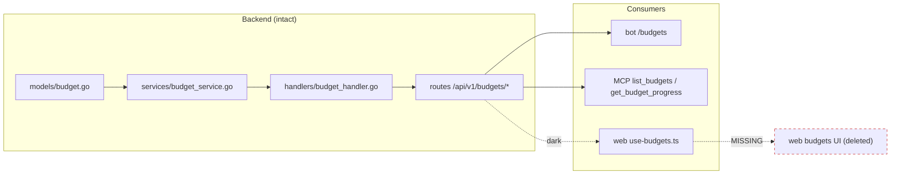
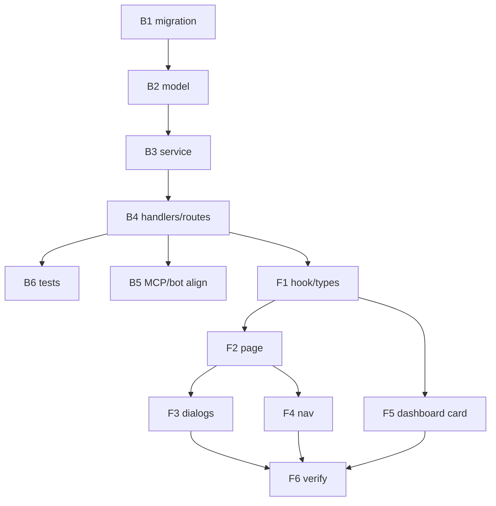

# Plan 016 — Budgets Reintegration

## Context

Budgets exist end-to-end on the backend (model, service, handlers, routes, MCP tools, Telegram
bot) and the web data layer (`use-budgets.ts`, types, api-client methods) is intact and drift-free.
The **UI was deleted** in the redesign commit `e6e8336f` ("feat(web): redesign frontend with
dark-first modern-fintech UI"). Only the React Query hook remains, unimported.

Live check via the Kuberan MCP: **zero budgets exist** for the user (not even inactive ones). This
is the key enabler — we can change the schema freely with no data migration risk.

## What the findings imply

1. **Reintegration is mostly additive UI work.** The hook, types, and api-client methods compile
   against the current codebase unchanged. No backend change is strictly *required* to put a page
   back. The backend hardening below is opt-in quality work, not a blocker.

2. **The empty database is a one-time window to fix the model honestly.** Several schema-level flaws
   (dead date columns, no uniqueness, no CHECK) are cheap to fix now and expensive to fix once real
   budgets exist. We should take this window.

3. **The stored feature and the actual behavior disagree.** `Budget` carries `StartDate` (required)
   and `EndDate` (nullable), but `GetBudgetProgress` (`budget_service.go:159-171`) derives its window
   purely from `time.Now()` and **never reads either column**. The feature that ships is "a recurring
   calendar-period spending cap per category," not "a budget for a specific date span." We must pick
   which of those two the model actually claims — right now it lies about supporting date ranges.

4. **`is_active` is decorative.** It is forced `true` on create, cannot be changed via `UpdateBudget`
   (`budget_service.go:104-137` has no `is_active` path), and is ignored by progress. The only way to
   stop a budget today is to delete it. A budgets UI that shows an active/inactive toggle (the old one
   did) would be showing a control that does nothing.

5. **The per-card progress call is an N+1 built into the UX.** The old page rendered one
   `useBudgetProgress` query per card; the bot loops `get_budget_progress` per budget. A dashboard
   widget would do the same. This scales linearly with budget count and is the single biggest reason
   to add a batch endpoint before rebuilding the UI, not after.

6. **Budgets only make sense on expense categories.** Progress sums `type = 'expense'` transactions
   only (`budget_service.go:177`). A budget on an income category is structurally always 0% spent. The
   old create dialog let you pick any category. The category picker must be filtered to expense types.

7. **Flat categories mask a rollup gap.** Progress matches `category_id` exactly. Your 34 expense
   categories are currently flat, so a parent/child rollup gap doesn't bite today — but the model
   supports `ParentID` (`category.go:20`), so a budget on a future "Car" parent would silently ignore
   "Fuel"/"Tolls" children. This is a documented-decision item, not an urgent fix.

8. **Nothing else depends on the current dead behavior.** No dashboard/summary/net-worth code reads
   budgets. The only live consumers are the bot and MCP, both of which we control and can adjust in
   lockstep. Blast radius of a backend change is small and fully in-repo.

## Design decisions (for your review)

| # | Decision | Recommendation | Rationale |
|---|----------|---------------|-----------|
| D1 | Date-range vs recurring model | **Drop `start_date` / `end_date`; keep `period` (monthly/yearly)** | The columns have never affected behavior. Removing them makes the model tell the truth and simplifies the create form from 5 fields to 4. Reversible later via a migration if custom ranges are ever wanted. |
| D2 | `is_active` | **Make it updatable; add a pause/resume toggle in UI** | Turns a dead field into a real feature; lets a user stop a budget without losing its history. |
| D3 | Batch progress | **Add `GET /api/v1/budgets/progress` returning progress for all (active) budgets in one query** | Kills the N+1 for page, dashboard card, and bot. Page becomes one list call + one progress call. |
| D4 | Uniqueness | **Enforce one active budget per (category, period) in the service layer** | Removes ambiguity for dashboard rollups and matches user intuition ("my monthly Food budget"). Enforced in service (clear `AppError`), optionally backed by a partial unique index. |
| D5 | Sub-category rollup | **Defer; document as a known limitation** | No nested expense categories exist today. Revisit if/when nesting is used. |
| D6 | Category picker scope | **Expense categories only** | Income budgets are always 0% spent by construction. |
| D7 | Dashboard presence | **Add a compact "Budgets" card** (top N by % used) linking to the page | This is what makes budgets get *used* daily — likely why the standalone page died the first time. |
| D8 | Over-budget display | **Cap bar width at 100%, show overspend in `bg-negative` with "over by X"** | `percentage` can exceed 100 and `remaining` can go negative by design; the UI must handle it. |

If you disagree with D1 (i.e. you actually want real date-ranged / one-off budgets), the plan
branches: instead of dropping the columns we make `GetBudgetProgress` honor them and add a `custom`
period. That is more code and a new concept; I'd only take it if custom ranges are a real want.

## Backend work plan

Assumes D1–D6 accepted. All under `apps/api`.

### B1 — Schema migration (`migrations/000012_*`… next free number)
- `ALTER TABLE budgets DROP COLUMN start_date, DROP COLUMN end_date;` (down re-adds them nullable).
- Add `CHECK (period IN ('monthly','yearly'))`.
- Add index on `(user_id, category_id)`.
- Add **partial unique index** `WHERE deleted_at IS NULL AND is_active` on `(user_id, category_id, period)` to back D4.
- Verify against the golangci/migrate tooling; confirm down migration is clean.

### B2 — Model (`internal/models/budget.go`)
- Remove `StartDate` / `EndDate` fields.
- Keep `IsActive` (now meaningful).

### B3 — Service (`internal/services/budget_service.go` + `interfaces.go`)
- `CreateBudget`: drop `startDate/endDate` params; add duplicate-active check → new `ErrBudgetExists` (or reuse a conflict AppError) for D4.
- `UpdateBudget`: add `isActive *bool` param and an `is_active` update path (D2); keep name/amount/period.
- `GetUserBudgets`: add deterministic `ORDER BY created_at DESC` (fixes non-deterministic pagination).
- New `GetActiveBudgetsProgress(userID) ([]BudgetProgress, error)`: single query — load active budgets, compute spend per category for the current period in one grouped aggregate rather than a loop. (D3)
- `GetBudgetProgress`: unchanged window logic (still `time.Now()`-based, which is now *correct* given D1). Optionally guard/ignore inactive.

### B4 — Handlers & routes (`internal/handlers/budget_handler.go`, `cmd/api/main.go`)
- `CreateBudgetRequest`/`UpdateBudgetRequest`: drop `start_date`/`end_date`; add `is_active *bool` to update.
- New handler `GetBudgetsProgress` → `GET /api/v1/budgets/progress`. **Note:** verify Gin does not
  panic on `/budgets/progress` (static) coexisting with `/budgets/:id` (param) — current Gin allows it,
  but if it complains use `/budgets/overview`. Register the static route before the param route.
- Fix Swagger annotations: `@Param id path string` (currently wrongly `int`) on all budget endpoints.
- Response wrapping: keep `{ "progress": [...] }` for the batch route for consistency.

### B5 — MCP + bot alignment
- MCP `internal/mcp/tools_budgets.go`: remove any StartDate/EndDate surfacing (none currently shown, so likely no change); `get_budget_progress` unchanged. Optionally add a batch `get_budgets_progress` tool.
- Bot `apps/bot/handlers/budgets.py`: currently N+1; can switch to the batch endpoint once B4 ships. Fix the `budget_id: int` type hint → `str`. Optional; bot keeps working unchanged.

### B6 — Tests
- Update existing service/handler/integration tests for the dropped columns and new signatures.
- Add: duplicate-active-budget rejection (D4), `is_active` update + pause hides from batch (D2/D3),
  batch progress correctness vs N single calls, ORDER BY determinism.
- Run `./scripts/check-go.sh apps/api` (build → vet → lint → test → race). Note the known
  golangci-lint go1.26 env issue from memory — fall back to build/vet/test/gofmt if lint panics.

## Frontend work plan

All under `apps/web/src`. Rebuild to current conventions (do **not** restore the deleted files
verbatim — they predate the redesign and use hardcoded colors).

### F1 — Hook touch-up (`hooks/use-budgets.ts`)
- Add `useBudgetsProgress()` for the batch endpoint (D3).
- Add `is_active` to `UpdateBudgetRequest` type (`types/api.ts`); drop `start_date`/`end_date` from
  `Budget`, `CreateBudgetRequest`, `UpdateBudgetRequest` (`types/models.ts`, `types/api.ts`) to match B2/B4.
- Ensure create/update mutations also invalidate the batch progress key.

### F2 — Page (`app/(dashboard)/budgets/page.tsx`)
Model on `categories/page.tsx` (closest structural match) + `accounts/page.tsx` (stat-card row):
- Header: `h1` + subtitle + "New budget" `Button size="sm"` with `Plus`.
- `StatCard` row (`grid gap-4 sm:grid-cols-3`): **Total budgeted**, **Total spent (this period)**,
  **Remaining** — fed by the batch progress call, not per-card queries.
- `Tabs` filter: All / Active / Inactive (reset `page` to 1 on change).
- Card grid (`sm:1 / md:2 / lg:3`): each card shows the linked **category's own icon/color**, name,
  period badge, active/paused state, budgeted amount, and a progress bar.
- Progress bar (D8): semantic tokens — `bg-primary` <75%, `bg-warning` 75–90%, `bg-negative` ≥90%;
  cap width at 100%; footer "spent / budgeted (pct%)" and "remaining" or "over by X".
- Skeleton, empty state (dashed border + CTA), Previous/Next pagination — all per current patterns.
- Edit/pause/delete per card.

### F3 — Dialogs (`components/budgets/`)
Follow `create-category-dialog.tsx` (inline error banner, `CurrencyInput` for cents, `toast`, `ApiClientError` mapping):
- **create-budget-dialog**: name, category (`Select` from `useCategories`, **expense-only**, D6),
  amount (`CurrencyInput`), period (`Select` monthly/yearly). No dates (D1).
- **edit-budget-dialog**: name, amount, period, active toggle (D2). Category immutable.
- **delete-budget-dialog**: confirmation.

### F4 — Navigation wiring
- `components/layout/app-sidebar.tsx`: add a `NavItem` in the "Money" section (icon `PiggyBank` or `Target`, href `/budgets`).
- `components/layout/command-palette.tsx`: add a "Budgets" navigation item; optionally a "Create budget" quick action.

### F5 — Dashboard card (D7)
- `components/dashboard/budgets-card.tsx`: compact card, top 3–4 budgets by % used (from batch
  endpoint), each a mini progress bar; "View all" → `/budgets`. Empty state → CTA to create first budget.
- Slot as a sibling of `SpendingCard` / `CashflowCard` in `app/(dashboard)/page.tsx`.
- Add a `BUDGET` entry to `lib/domain-visuals.ts` only if we want a budget-specific chip; otherwise
  reuse the linked category's visuals (preferred — matches the rest of the app).

### F6 — Verify
- `pnpm build` / typecheck clean.
- E2E via Playwright MCP against the running app: create → appears with correct progress → edit →
  pause hides from dashboard rollup → delete. Pixel-check the progress bar states and over-budget
  case (per your UI standards).

## Sequencing

Recommended commits/PRs:
1. **PR 1 — backend model cleanup + batch endpoint** (B1–B4, B6). Self-contained, tested, no UI.
2. **PR 2 — budgets page + dialogs + nav** (F1–F4, F6 page-level).
3. **PR 3 — dashboard budgets card** (F5).
4. **PR 4 (optional) — bot switch to batch endpoint** (B5 bot part).

## Risks & mitigations

- **Gin static/param route conflict** (`/budgets/progress` vs `/budgets/:id`): verify at build; fall
  back to `/budgets/overview` if it panics. Low.
- **Dropping columns is a one-way door if custom ranges are later wanted**: mitigated by keeping the
  down migration; and by confirming D1 with you before B1. Medium → gated on your sign-off.
- **golangci-lint env breakage** (known, in memory): verify with build/vet/test/gofmt. Low.
- **Currency**: `formatCurrency` defaults to MYR and takes cents — budgets are cents, so no conversion
  bug, but confirm the page uses `formatCurrency` not raw values. Low.

## Decisions locked (2026-07-15 review)

- **D1 → Recurring.** Drop `start_date` / `end_date`; budgets are monthly/yearly caps per category.
- **D4 → Unique.** Enforce one active budget per (category, period).
- **D7 → Dashboard card in scope.** Ship the compact budgets card (PR 3).
- **D2, D3, D5, D6, D8** proceed as recommended in the decision table above.

## Scope locked

**Backend first (PR 1), review before UI.** Build and verify the model cleanup + batch endpoint,
check in, then proceed to PR 2 (page) and PR 3 (dashboard card).
