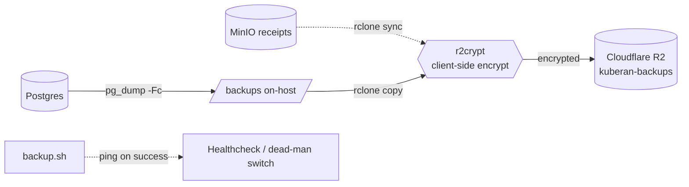

# Backup & Disaster-Recovery Runbook (plans/017 Phase 0)

Off-host, client-side-encrypted replication of the Postgres dumps (and, once
receipts deploy, the MinIO receipts bucket) to Cloudflare R2. This runbook
covers the topology, one-time setup, restore drills, and failure response.

## Topology



- `backup.sh` runs on the supercronic schedule inside the `backup` service.
- On-host `/backups` keeps `BACKUP_RETENTION_DAYS` (default 30) of `.dump` files.
- `r2crypt` is an rclone **crypt** remote wrapping the `r2` S3 remote, so both
  filenames and contents are encrypted before leaving the host. Cloudflare
  stores only ciphertext.
- The receipts mirror activates once receipts deploy (Phase 4): the backup
  service sets `RECEIPTS_BUCKET` in `docker-compose.prod.yml`, and `minio-init`
  enables versioning on the source MinIO bucket. It stays a no-op only while
  the `RCLONE_CONFIG_MINIO_*` source remote is left unconfigured.

## One-time setup

1. **Create the R2 bucket** `kuberan-backups` and an API token scoped to it.
2. **Enable bucket versioning** on `kuberan-backups` so a bad `rclone sync`
   (or ransomware) cannot erase history. Optionally add a lifecycle rule to
   expire noncurrent versions after 90 days.
3. **Generate the crypt passphrases** locally:
   ```sh
   rclone obscure 'a-long-random-passphrase'   # -> RCLONE_CONFIG_R2CRYPT_PASSWORD
   rclone obscure 'a-second-random-salt'        # -> RCLONE_CONFIG_R2CRYPT_PASSWORD2
   ```
   Store the **plaintext** passphrases in an off-VPS password manager. Losing
   them makes every off-host copy permanently unrecoverable.
4. **Populate `.env.prod`** with the `RCLONE_CONFIG_*` and `HEALTHCHECK_URL`
   values documented in `.env.prod.example`. For receipts (Phase 4), set the
   `RCLONE_CONFIG_MINIO_*` source remote to the same scoped keys as
   `STORAGE_ACCESS_KEY`/`STORAGE_SECRET_KEY`; `RECEIPTS_BUCKET` is supplied
   automatically by the compose backup service, and MinIO source-bucket
   versioning is enabled automatically by `minio-init`.
5. **Create a healthcheck** (e.g. healthchecks.io) and set `HEALTHCHECK_URL`.

## Verifying a run

```sh
# Trigger a one-off backup inside the running service.
docker compose -f docker-compose.prod.yml exec backup /backup.sh

# Confirm the encrypted object landed (decrypted listing via the crypt remote).
docker compose -f docker-compose.prod.yml exec backup rclone ls r2crypt:db/
```

A successful run also flips the healthcheck to "up". A missed ping means the
run failed somewhere before the dead-man's-switch line.

## Restore drill (do this once before relying on it)

Restore into a **scratch database**, never straight over production.

```sh
# 1. Pull the newest encrypted dump back and decrypt it in one step.
rclone copy r2crypt:db/ ./restore/ --include '*.dump'

# 2. Restore into a fresh scratch DB.
createdb kuberan_restore
pg_restore --no-owner --no-acl -d kuberan_restore ./restore/kuberan_<ts>.dump

# 3. Sanity-check row counts against expectations.
psql -d kuberan_restore -c '\dt'
psql -d kuberan_restore -c 'SELECT count(*) FROM transactions;'

# 4. (Once receipts deploy) restore the receipts bucket.
rclone copy r2crypt:receipts/ minio:kuberan-receipts/ --s3-no-check-bucket
```

Verify the app boots against the scratch DB, then drop it.

## Failure response

| Symptom | Likely cause | Action |
|---------|--------------|--------|
| Healthcheck flips to "down" | `pg_dump`, `rclone`, or connectivity failed | Read the backup container logs; the last `log` line marks the failing step. |
| `rclone` auth error | Rotated/expired R2 token | Regenerate the R2 token, update `RCLONE_CONFIG_R2_*` in `.env.prod`, redeploy. |
| Decrypt fails on restore | Wrong passphrase | Use the passphrase pair from the off-VPS password manager; both PASSWORD and PASSWORD2 must match. |
| Receipts mirror deleted objects | Bad `sync` | Recover prior object versions from R2 versioning. |
