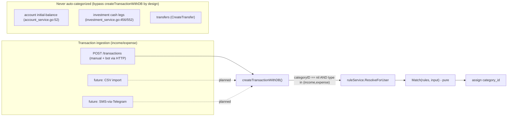
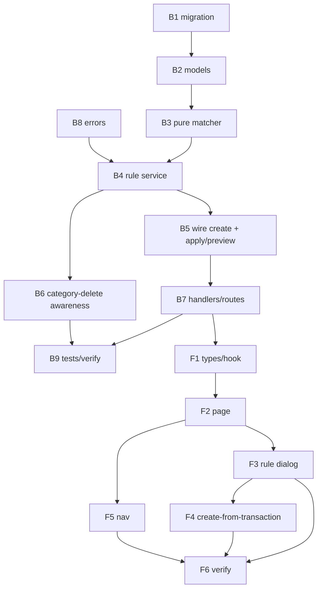

# Plan 018 - Transaction Rules Engine + Auto-Categorization

## Context

Kuberan is manual-entry: every income/expense transaction needs a category chosen by hand, or it
stays uncategorized. This is tedious today and unworkable for the roadmap (CSV import, SMS-via-Telegram
ingestion) where transactions arrive in bulk. **Rules** let a user teach the app their patterns once
("description contains GRAB and amount < $50 → Transport") and have new transactions auto-categorized
on creation, plus a one-off **backfill** to categorize existing transactions.

No rules code exists yet (confirmed: grep for `rule`/`match`/`categorize`/`auto` across
`internal/{services,handlers,models}` is empty). The data model is clean and the category-assignment
seam is a single private function. This is a purely additive feature.



## What the reviews changed (adversarial + architecture pass)

This plan was stress-tested by an adversarial reviewer and an architecture reviewer against the
actual code. The findings that materially shaped the design:

1. **`CreateTransaction` is *not* the single choke point.** Three paths build `models.Transaction`
   rows directly and bypass it: initial-balance (`account_service.go:52`), investment cash legs
   (`investment_service.go:456`/`:552`), and transfers (`CreateTransfer`). This is *desired* - none of
   those should be auto-categorized. We hook the shared private `createTransactionWithDB`
   (`transaction_service.go:73`), which the manual path and future CSV/SMS ingestion all funnel
   through, and explicitly exclude the other three by construction.

2. **No category-type validation exists anywhere** (`transaction_service.go` never checks
   `category.Type` against transaction `Type`). The engine would *industrialize* this latent bug - an
   income category silently attached to expense transactions corrupts `GetSpendingByCategory`
   (`:571`, no type filter) and the dashboard pie. We add type-consistency validation at rule-write
   time **and** a defensive skip in the matcher.

3. **Backfill must not reuse `UpdateTransaction`.** That path does balance reversal (`:236`/`:265`)
   and rejects transfers/investments. Category changes are balance-neutral, so backfill uses a
   dedicated category-only update.

4. **Dependency direction is one-way.** `Match` is a **pure function** (no DB). `transactionService →
   ruleService` is the only edge. Bulk transaction reads/writes for rules (backfill, preview) live on
   `transactionService`, which already depends on `ruleService` - no cycle.

5. **`Resolve` returns a result object, not `*categoryID`** - so Preview, Apply, and future
   multi-valued actions (tags) share one matcher with zero divergence.

6. **Action is a child table** (`transaction_rule_actions`), symmetric with conditions - future
   actions (tags, rename, hide) are additive `action_type` values, not a migration on populated data.

7. **Second binary:** changing `NewTransactionService`'s signature forces a matching edit to
   `cmd/mcp/main.go:45` or the MCP binary won't compile.

## Design decisions

| # | Decision | Choice | Rationale |
|---|----------|--------|-----------|
| D1 | Rule expressiveness | **Multi-condition** (AND within a rule, OR across rules) | Monarch-grade; avoids a redesign. Locked with user. |
| D2 | Where the engine runs | **`createTransactionWithDB` (service layer)** | Single shared seam for manual + future CSV/SMS. Handler-level would miss the bot/MCP path. |
| D3 | Fire timing | **Create-time (when no category set) + explicit backfill only** | Predictable; never silently overrides a manual edit. Locked with user. |
| D4 | Matcher shape | **Pure `Match(rules, input) → RuleResult`** | Trivially table-testable; shared by Resolve/Preview/Apply; no DB in the hot path. |
| D5 | Action storage | **Child `transaction_rule_actions` table** | Symmetric with conditions; tags/rename/hide become additive. Locked with user (Option B). |
| D6 | Evaluation | **Terminal first-match-wins by `priority ASC, created_at ASC`** | Deterministic, debuggable. Result object reserves accumulating semantics for future tags. |
| D7 | Category-type safety | **Validate at write time; skip at match time** | Closes the latent mis-typing bug; defends against post-hoc category edits/deletes. |
| D8 | Backfill balance safety | **Dedicated balance-neutral category-only update** | Never routes through balance-reversing `UpdateTransaction`. |
| D9 | Deleted-category targets | **On category delete, deactivate targeting rules; matcher skips soft-deleted targets** | `DeleteCategory` has no rule awareness today; prevents dangling assignments. |
| D10 | Regex operator | **Cut from v1** | Out of character for this security-conscious codebase; a 500-char pattern on the hot path is wasteful. Additive later. |
| D11 | Audit logging | **Handler-side only** | Matches existing pattern (`transaction_handler.go:99`); do not inject `auditService` into `transactionService`. Auto-assignment on create is intentionally silent. |
| D12 | Conditions/actions `user_id` | **Drop it - carry `user_id` only on the parent rule** | Children are always loaded via their user-scoped parent; the denormalized column is unused. |

## Data model

Migration `000027_create_transaction_rules` (next free number). UUIDv7 PKs, `NOW()` defaults.
**The parent rule uses soft-delete (`Base`). Conditions and actions are wholly-owned value objects -
no soft-delete; they are replaced (delete + reinsert) on rule update, with `ON DELETE CASCADE` as the
hard-delete safety net.**

```sql
CREATE TABLE transaction_rules (
    id          UUID PRIMARY KEY DEFAULT uuid_generate_v7(),
    created_at  TIMESTAMPTZ NOT NULL DEFAULT NOW(),
    updated_at  TIMESTAMPTZ NOT NULL DEFAULT NOW(),
    deleted_at  TIMESTAMPTZ,
    user_id     UUID NOT NULL REFERENCES users(id),
    name        VARCHAR(120) NOT NULL,
    priority    INT NOT NULL DEFAULT 0,          -- lower = evaluated first
    is_active   BOOLEAN NOT NULL DEFAULT TRUE
);
CREATE INDEX idx_transaction_rules_user_active_priority
    ON transaction_rules (user_id, is_active, priority);
CREATE INDEX idx_transaction_rules_deleted_at ON transaction_rules (deleted_at);

CREATE TABLE transaction_rule_conditions (
    id          UUID PRIMARY KEY DEFAULT uuid_generate_v7(),
    created_at  TIMESTAMPTZ NOT NULL DEFAULT NOW(),
    rule_id     UUID NOT NULL REFERENCES transaction_rules(id) ON DELETE CASCADE,
    field       VARCHAR(24) NOT NULL,            -- description | amount | account_id | type
    operator    VARCHAR(16) NOT NULL,            -- see operator matrix
    value_text  VARCHAR(500),                    -- text / account-uuid / type value
    amount_min  BIGINT,                          -- cents (gt, between)
    amount_max  BIGINT,                          -- cents (lt, between)
    CONSTRAINT trc_field_check    CHECK (field IN ('description','amount','account_id','type')),
    CONSTRAINT trc_operator_check CHECK (operator IN
        ('contains','not_contains','equals','starts_with','ends_with','gt','lt','between'))
);
CREATE INDEX idx_transaction_rule_conditions_rule_id ON transaction_rule_conditions (rule_id);

CREATE TABLE transaction_rule_actions (
    id           UUID PRIMARY KEY DEFAULT uuid_generate_v7(),
    created_at   TIMESTAMPTZ NOT NULL DEFAULT NOW(),
    rule_id      UUID NOT NULL REFERENCES transaction_rules(id) ON DELETE CASCADE,
    action_type  VARCHAR(24) NOT NULL,           -- v1: 'set_category'
    category_id  UUID REFERENCES categories(id), -- for set_category
    value_text   VARCHAR(500),                   -- reserved for future actions (rename/tag)
    CONSTRAINT tra_action_check CHECK (action_type IN ('set_category'))
);
CREATE INDEX idx_transaction_rule_actions_rule_id ON transaction_rule_actions (rule_id);
```

**Operator × field matrix (validated at write time):**

| Field | Allowed operators | Value column(s) |
|-------|-------------------|-----------------|
| `description` | contains, not_contains, equals, starts_with, ends_with | `value_text` (case-insensitive) |
| `amount` | gt, lt, between | `amount_min` (gt/between), `amount_max` (lt/between) |
| `account_id` | equals | `value_text` = account UUID |
| `type` | equals | `value_text` in (income, expense) |

## Backend work plan

All under `apps/api`. Model on `budget_service.go` (closest CRUD-plus-computed analog).

### B1 - Migration (`migrations/000027_create_transaction_rules.{up,down}.sql`)
- Three tables above. Down drops them in reverse FK order. Use `IF NOT EXISTS` / `IF EXISTS`.

### B2 - Models (`internal/models/transaction_rule.go`)
- `TransactionRule` (embeds `Base`) with `Conditions []TransactionRuleCondition` and
  `Actions []TransactionRuleAction` (`gorm:"foreignKey:RuleID"`), plus `Action`-side
  `Category *Category` preloaded so the matcher sees the target category's **type** without a DB call.
- `TransactionRuleCondition`, `TransactionRuleAction` as plain structs (id, created_at, no soft-delete).
- Enum consts: `RuleField*`, `RuleOperator*`, `RuleActionType*`.

### B3 - Pure matcher (`internal/services/rule_matcher.go`)
```go
type RuleInput struct {
    Description string
    Amount      int64
    AccountID   string
    Type        models.TransactionType
}
type RuleResult struct {
    CategoryID    *string // first matching terminal set_category (nil if none)
    MatchedRuleID *string
    // future: Tags []string (accumulating across all matches)
}
// Match assumes rules are active, pre-sorted (priority ASC, created_at ASC),
// with Conditions + Actions + Action.Category preloaded. No DB access.
func Match(rules []models.TransactionRule, in RuleInput) RuleResult
```
- Per rule: all conditions must pass (AND). Text compares case-insensitive; amount in cents.
- **Type-safety skip (D7):** a `set_category` action is only honored if its preloaded `Category` is
  non-nil (not soft-deleted) **and** `Category.Type == in.Type`. Otherwise the rule is skipped.
- First honored `set_category` sets `CategoryID` and stops (terminal).
- Pure ⇒ exhaustive table-driven tests (`rule_matcher_test.go`): every operator × field, case folding,
  cents boundaries, AND semantics, priority order, type-mismatch skip, soft-deleted-target skip.

### B4 - Rule service (`internal/services/rule_service.go` + `interfaces.go`)
`NewRuleService(db, categoryService) RuleServicer`. Depends on `db` + `categoryService` only - **no
dependency on `transactionService`.**
- `CreateRule / GetRule / ListRules / UpdateRule / DeleteRule` - CRUD; conditions+actions replaced
  wholesale on update inside one `db.Transaction`. Validation → new AppError sentinels:
  - operator valid for field; `amount_min <= amount_max` for `between`; `value_text` present where
    required; `type` value ∈ {income, expense}; `account_id` belongs to user.
  - `set_category` target category exists, belongs to user, not soft-deleted.
- `ReorderRules(userID, ruleIDs []string)` - set `priority = index` for the user's rules in one
  `db.Transaction`.
- `ResolveForUser(userID string, in RuleInput) (RuleResult, error)` - loads the user's **active** rules
  (`ORDER BY priority ASC, created_at ASC`) with conditions/actions/action.Category preloaded, then
  delegates to `Match`. One query for rules; matching is in-memory.
- `LoadRule(userID, ruleID)` helper reused by backfill/preview.

### B5 - Wire into creation + bulk ops on `transactionService`
- `NewTransactionService(db, accountService, ruleService)` - add the `ruleService` dependency.
  **Update `cmd/api/main.go` AND `cmd/mcp/main.go:45`** (second binary won't compile otherwise).
- In the manual create path: resolve **before** opening the write transaction (don't extend the
  account-row lock). Only when `categoryID == nil && (type == income || type == expense)`:
  ```go
  if categoryID == nil && (txType == income || txType == expense) {
      res, _ := s.ruleService.ResolveForUser(userID, RuleInput{description, amount, accountID, txType})
      categoryID = res.CategoryID // nil-safe; rule failure never blocks manual creation
  }
  ```
  Then proceed into `createTransactionWithDB` unchanged. (Investment/transfer paths untouched - D2.)
- `PreviewMatches(userID string, conditions []RuleConditionInput) (PreviewResult, error)` - builds a
  synthetic rule, streams the user's income/expense transactions, matches via `Match`, returns
  count + a small sample. Read-only.
- `ApplyRule(userID, ruleID string, opts ApplyOptions) (ApplyResult, error)` - backfill:
  - Loads the rule via `ruleService.LoadRule`.
  - Selects candidate transactions by `scope` (`uncategorized` → `category_id IS NULL`; `all`),
    income/expense only.
  - Matches in memory (rules loaded once - no N+1).
  - `dry_run` → return count + sample, no writes.
  - Commit → **balance-neutral category-only update** in one `db.Transaction`:
    `tx.Model(&Transaction{}).Where("id = ? AND user_id = ?", id, userID).Update("category_id", cat)`.
    Respect `overwrite` (skip already-categorized unless set). Never calls `UpdateTransaction`.

### B6 - Category deletion awareness (D9)
- Extend `DeleteCategory` (`category_service.go:189`): in the same transaction, set `is_active = false`
  on any `transaction_rules` whose action targets the deleted category (join via
  `transaction_rule_actions.category_id`). The matcher already skips soft-deleted targets, but
  deactivating makes the state visible in the UI. Add a test.

### B7 - Handlers & routes (`internal/handlers/rule_handler.go`, `cmd/api/main.go`)
`RuleHandler` holds **both** `ruleService` and `transactionService` (preview/apply live on the latter).
Mirror `transaction_handler.go` binding + `respondWithError` + handler-side `auditService.Log`
(`CREATE_RULE`/`UPDATE_RULE`/`DELETE_RULE`/`REORDER_RULES`/`APPLY_RULE`).

```
POST   /api/v1/rules
GET    /api/v1/rules
GET    /api/v1/rules/:id
PUT    /api/v1/rules/:id
DELETE /api/v1/rules/:id
POST   /api/v1/rules/reorder     # { rule_ids: [...] }
POST   /api/v1/rules/preview     # unsaved conditions -> { count, sample }
POST   /api/v1/rules/:id/apply   # { scope, overwrite, dry_run } -> { count, sample, applied }
```
- **Gin static/param ordering:** register `/rules/reorder` and `/rules/preview` (static) **before**
  `/rules/:id` (param). If Gin panics on the mix, fall back to `/rules/-/reorder` and note it in the
  contract. (Same gotcha handled in plan 016.)

### B8 - Errors (`internal/errors`)
Add sentinels alongside the budget block: `ErrRuleNotFound`, `ErrRuleInvalid`,
`ErrRuleConditionInvalid`, `ErrRuleActionInvalid`, `ErrRuleCategoryTypeMismatch`.

### B9 - Tests & verify
- Matcher: exhaustive table tests (B3).
- Service: CRUD + validation rejects; reorder determinism; ResolveForUser end-to-end; ApplyRule
  dry-run counts, overwrite semantics, uncategorized-only scoping, balance-neutrality (assert account
  balances unchanged after backfill); category-delete deactivates rules (B6).
- Integration: `POST /transactions` with no category → correct rule assigns it; explicit category
  never overridden; transfer/investment never categorized; type-mismatched rule skipped.
- `./scripts/check-go.sh apps/api` (build → vet → lint → test → race). Known golangci-lint go1.26 env
  issue: fall back to build/vet/test/gofmt if lint panics (see memory).

## Frontend work plan

All under `apps/web/src`. Follow `use-categories.ts` / `categories/page.tsx` / `create-category-dialog.tsx`.

### F1 - Types & hook (`types/models.ts`, `types/api.ts`, `hooks/use-rules.ts`)
- Types: `TransactionRule`, `RuleCondition`, `RuleAction`, `RuleField`, `RuleOperator`,
  `RuleActionType`; request DTOs (`CreateRuleRequest`, `UpdateRuleRequest`, `ReorderRulesRequest`,
  `RulePreviewRequest`/`Response`, `ApplyRuleRequest`/`Response`).
- `ruleKeys` factory + `useRules`, `useRule`, `useCreateRule`, `useUpdateRule`, `useDeleteRule`,
  `useReorderRules`, `useRulePreview` (mutation), `useApplyRule` (mutation). Invalidate `ruleKeys` and,
  on apply, `transactionKeys.all`.

### F2 - Rules page (`app/(dashboard)/rules/page.tsx`)
- Header (`h1` + subtitle + "New rule" `Button size="sm"` with `Plus`).
- List ordered by priority. Each row: name, a human summary of conditions
  ("description contains GRAB · amount < RM50 → Transport"), the target category chip
  (icon/color from the linked category via `domain-visuals`), an active/paused `Switch`, up/down
  reorder buttons (calls `useReorderRules`), edit, delete.
- Skeleton, dashed empty-state + CTA. No multi-select (backfill is server-side, rule-scoped).

### F3 - Rule dialog (`components/rules/{create,edit,delete}-rule-dialog.tsx`)
- **Condition builder:** add/remove AND-ed rows. Each row: field `Select` → operator `Select`
  (filtered to the field's allowed operators) → value input adapting to field (text; `CurrencyInput`
  for amount with min/max for `between`; account `Select`; type `Select`).
- **Action:** category `Select` from `useCategories`. Filter the picker to match the intended
  transaction type; surface the type-mismatch error from the backend if it slips through.
- **Live preview:** debounced `useRulePreview` on the current conditions → "Matches N existing
  transactions" with a small sample.
- On save: prompt "Apply to N existing transactions now?" → `useApplyRule` (default
  `scope=uncategorized`, `overwrite=false`; show the dry-run count first, then confirm).
- Inline error banner, `toast`, `ApiClientError` mapping (per `create-category-dialog.tsx`).

### F4 - "Create rule from transaction" (`components/transactions/edit-transaction-dialog.tsx`)
- A "Create rule from this…" affordance that opens the rule dialog **prefilled** with a
  `description contains <token>` condition and the current category as the action.
- **Critical (m9):** there is no merchant field - only free-text `description`. Prefill an
  **editable** substring (a best-guess token, e.g. the longest alphabetic run), never the raw
  `"STARBUCKS #4021 SEATTLE 08/29"`, or the rule generalizes terribly. Note: a future normalized
  merchant field (populated by the CSV/SMS parsers) would make this far better - the natural tie-in to
  the SEA-ingestion roadmap.

### F5 - Navigation
- `components/layout/app-sidebar.tsx`: add a "Rules" `NavItem` to the **Money** section (icon `Filter`
  or `Wand2`, href `/rules`).
- `components/layout/command-palette.tsx`: "Rules" nav item + optional "Create rule" quick action.

### F6 - Verify
- `pnpm build` / typecheck clean.
- E2E via Playwright MCP: create a rule → live preview shows a count → save → new matching
  transaction auto-categorizes → backfill categorizes existing → paused rule stops firing → delete.
  Pixel-check the condition-builder rows and the summary chips (per UI standards).

## Sequencing



Recommended PRs:
1. **PR 1 - backend engine** (B1–B9). Migration, models, pure matcher, rule service, wiring,
   category-delete awareness, handlers, tests. Self-contained, no UI. **Review before UI.**
2. **PR 2 - rules page + dialog + nav** (F1–F3, F5, F6 page-level).
3. **PR 3 - create-rule-from-transaction quick flow** (F4).

## Risks & mitigations

- **Gin static/param route conflict** (`/rules/reorder`,`/rules/preview` vs `/rules/:id`): register
  static first; fall back to `/rules/-/…` if it panics. Low.
- **Constructor signature change breaks the MCP binary** (`cmd/mcp/main.go:45`): edit both entrypoints
  in the same commit; the full build catches it. Low.
- **Backfill on a large history**: rules loaded once, matched in memory, single balance-neutral update
  transaction; dry-run default surfaces the count before any write. Low/medium.
- **Category edited to a different type after a rule targets it**: matcher skips on type mismatch at
  match time (D7), so no corruption - the rule simply stops firing until fixed. Low.
- **golangci-lint go1.26 env breakage** (known, in memory): verify with build/vet/test/gofmt. Low.

## Decisions locked (2026-08-31 review)

- **D1 Multi-condition. D3 Create-time + backfill only. D5 Child actions table.** (Confirmed with user.)
- **D2, D4, D6–D12** proceed as in the decision table (adopted from the adversarial + architecture pass).

## Scope locked

**Backend first (PR 1), review before UI.** Build and verify the engine end-to-end (matcher, service,
wiring, backfill, tests), check in, then PR 2 (page + dialog) and PR 3 (create-from-transaction).
